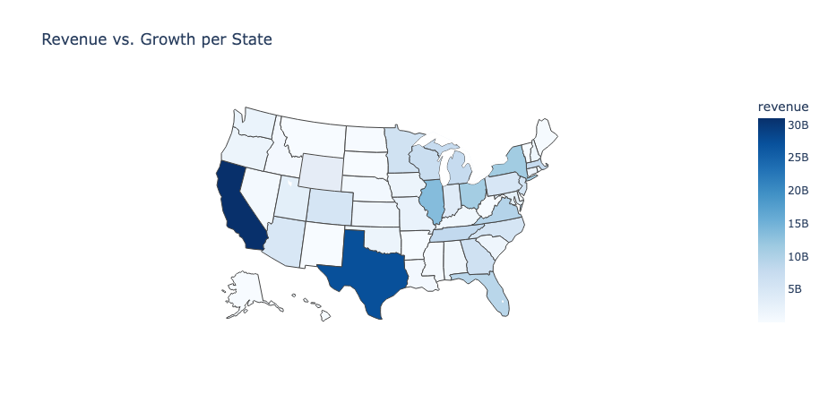

# tableau-5000-inc-dataset
This is a repo where I explored the data first and further play with the dataset alongside the tableau story here https://public.tableau.com/views/5000incdataset-storyKE/Story1?:language=en-US&amp;publish=yes&amp;:display_count=n&amp;:origin=viz_share_link 

The visualizations in the notebook are in plotly format, you can run the notebook to visualize them, here in the notebook comes static snapshot of the figures

